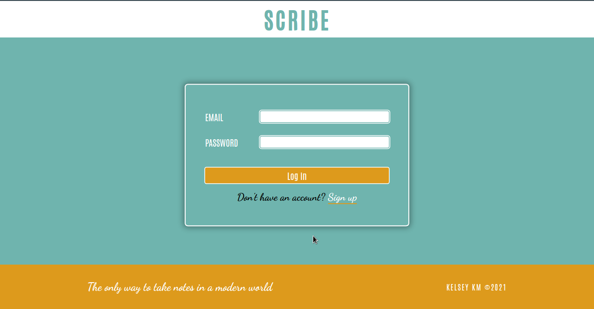
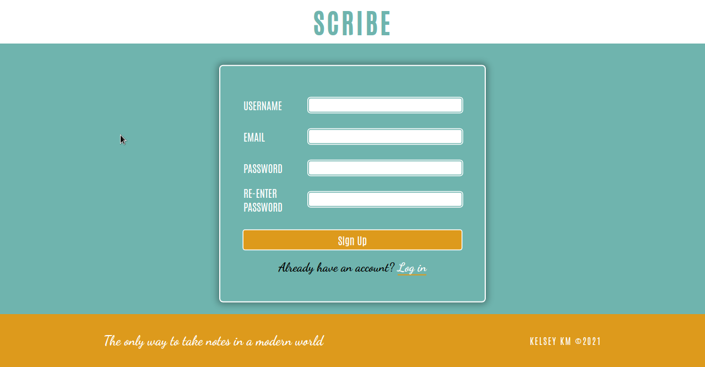
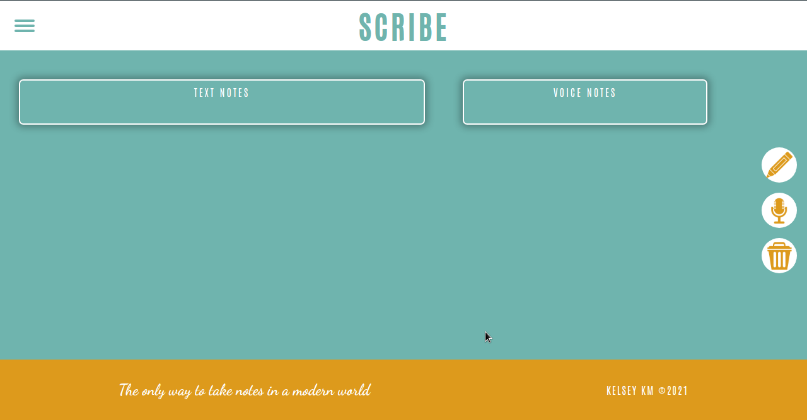
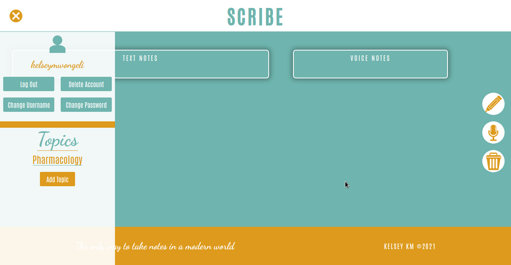
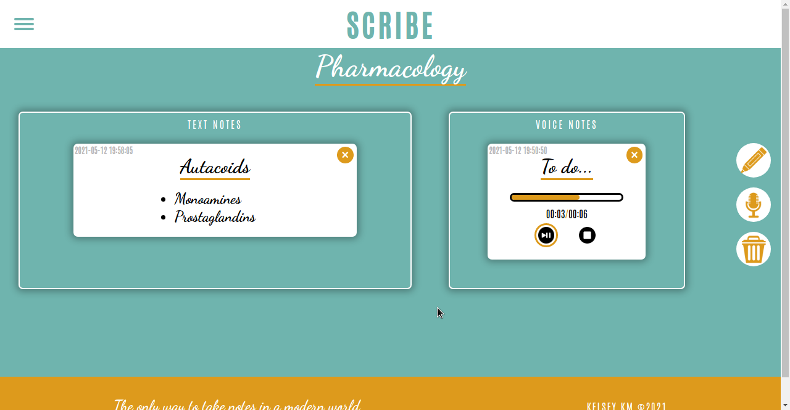
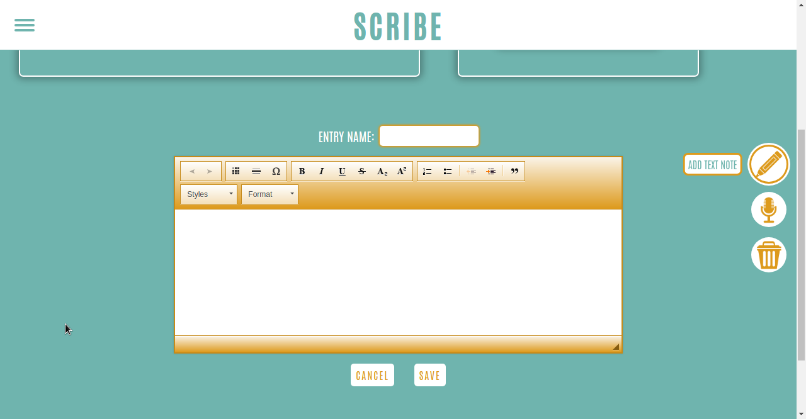
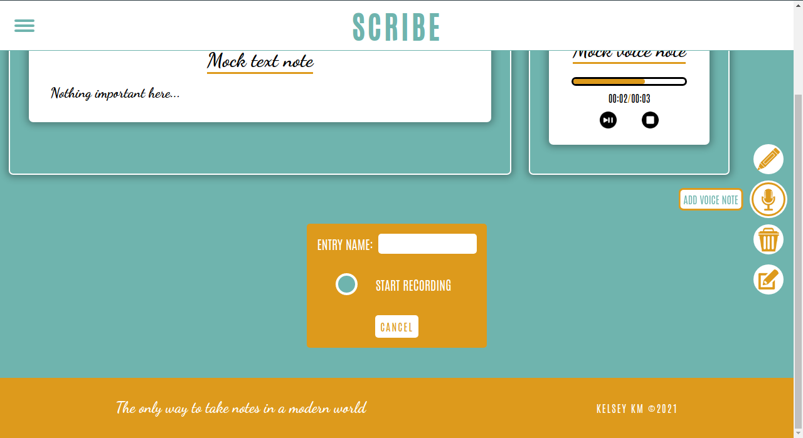

# **scribe**
*The only way to take notes in a modern world*

#### **scribe IS NOW DEPRECATED, PLEASE USE _scribe2_ at: https://github.com/kelseykm/scribe2**

* Scribe is a web application that allows you to take both voice and text notes.
* The notes are separated by topics.
* Each user has an account.

### **Installation**
* Ensure you have Nodejs installed.
* ```cd``` into the directory containing the ```package.json``` file and run ```npm install``` to install all the dependencies.
* Make a directory called ```certs```, ```cd``` into it and run ```openssl req -x509 -newkey rsa:4096 -keyout key.pem -out cert.pem -days 365```
* Put the passphrase of the private key generated in the ```.env``` file.
* Also provide a *session secret* in the ```.env``` file. It can be anything...any random string.

### **Start up**
* To start the app, ```cd``` into the directory with the app and run ```npm run start```
* In your browser, go to ```https://localhost:8080```








